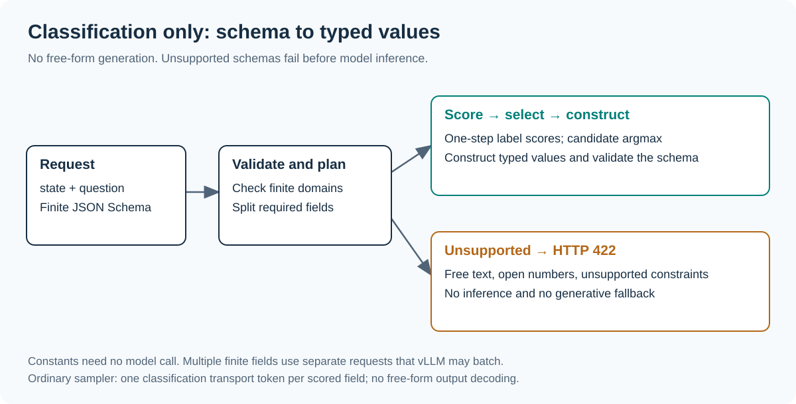

# vllm-jev-decison

**Classification-only typed decisions for compatible vLLM language models.**

[中文](README.zh-CN.md) · [Installation & usage](docs/GUIDE.md) · [Examples](examples) · [Validation](results/README.md)

Supply text, a question and a finite JSON Schema. The plugin scores candidate
labels, selects typed values, and constructs the result in code. **No free-form
answer generation, mixed inference, or generative fallback is available.**
Unsupported schemas are rejected before model inference.



This is an independent Jev-like interface, not a reproduction of Jev's model or
a promise of equivalent accuracy or speed. It requires no model-specific head,
weight training or vLLM source patch.

## Install

Target API: **vLLM 0.29.0**, Python 3.11+. Install in the server environment:

```bash
git clone https://github.com/siliconkernel/vllm-jev-decison.git
cd vllm-jev-decison
pip install '.[vllm]'
vllm-jev-decison doctor
export VLLM_PLUGINS="${VLLM_PLUGINS:+$VLLM_PLUGINS,}jev-decison"
vllm serve YOUR_MODEL --logprobs-mode raw_logprobs --max-logprobs 16
```

If that vLLM version is already installed, use `pip install .`. Preserve other
required plugins in the allowlist. Configure `VLLM_API_KEY` or vLLM `--api-key`
for authentication. The package is installed from this repository, not a claimed
PyPI release. [Full installation and troubleshooting guide](docs/GUIDE.md).

## Use

```bash
curl http://localhost:8000/plugins/jev-decison/infer \
  -H 'Content-Type: application/json' \
  --data-binary @examples/request.json
```

Add `-H "Authorization: Bearer $VLLM_API_KEY"` when authentication is configured.
The [example request](examples/request.json) classifies a customer message into
an enum category and a boolean urgency flag:

```json
{
  "state": "My card was charged twice. Please refund me urgently.",
  "question": "Categorize this request and identify urgency.",
  "schema": {
    "type": "object",
    "properties": {
      "category": {"enum": ["billing", "technical", "other"]},
      "urgent": {"type": "boolean"}
    },
    "required": ["category", "urgent"],
    "additionalProperties": false
  },
  "mode": "classify",
  "min_confidence": 0.8
}
```

`mode` is optional and only accepts `classify`. `auto`, `generate`, output-token
budgets and nonfinite fields are rejected with HTTP 422. No fallback is run.

The response contains `accepted`, `value`, per-field `decisions`, and `usage`.
If any classified field misses the threshold, `accepted=false` and `value=null`.
Selected values in `decisions` are diagnostic proposals, not accepted results.
`GET /plugins/jev-decison/capabilities` reports the active backend and limits.
The [Python client](examples/client.py) uses `JEV_DECISON_URL` and optional
`JEV_DECISON_API_KEY`.

## Supported output schemas

| Schema | Behavior |
| --- | --- |
| Enum with at most 16 values | Score candidate labels and select a value |
| Boolean | Classify false / true |
| Bounded integer interval, at most 16 values | Classify the numeric value |
| Constant or null | Construct directly, without a model call |
| Closed, fully required object of supported fields | Classify fields independently; supports nesting |
| Free text, open numbers, optional fields, arbitrary arrays or unsupported joint constraints | Reject before inference |

Explicit finite `enum`/`const` values may themselves be objects or arrays; the
plugin selects the entire declared value. It does not generate their contents.
Every completed result is validated against the root schema.

Limits: 32 fields, 16 candidates per field, 64,000 input characters, 32 KB schema
and 20 nesting levels. Draft 2020-12 is used; references are rejected in v0.1.
`format` is an annotation, not an enforced format checker.

## How classification works

Candidate values map to tokenizer-checked single-token labels A–P. The engine
computes next-token logprobs, the adapter reads the requested candidate scores,
and argmax selects a value. The model never serializes the output object's keys
or selected values; Python builds them from the declared schema and candidate table.

The portable backend still uses the ordinary vLLM sampler with `max_tokens=1`.
Its one output token is counted as a **classification transport token**, even
though its text is ignored. `generated_tokens` is always zero for this API;
that does not mean zero output tokens or a model with a new classification head.
Multiple fields create multiple engine requests, with at most eight active per
API process. vLLM may batch them. This is not one forward for all questions,
not a sampler-bypass patch, and not retained-session KV fusion.


Conditional candidate probabilities are not calibrated correctness estimates.
`candidate_mass` separately reports raw vocabulary probability assigned to the
labels. Label order, prompts, model training and distribution shift affect results.
Constants have no model confidence score. Schema-valid does not mean task-correct.

## Integration and evidence


The native plugin uses vLLM's official
[EndpointPlugin interface](https://docs.vllm.ai/en/v0.29.0/design/endpoint_plugins/)
and existing EngineClient. It does not load another model. The optional bridge
provides the same classification-only API over an existing vLLM server:

```bash
pip install '.[bridge]'
vllm-jev-decison bridge --upstream http://127.0.0.1:8000 --model /model --port 18186
```

The bridge backend is explicitly `http_bridge`, not native plugin deployment.
It requires `/tokenize` and requested raw token logprobs, not structured-generation
support. See the [guide](docs/GUIDE.md) for separate bridge/upstream authentication.

Intended models are vLLM-supported autoregressive text models with compatible
single-token labels and raw requested logprobs. Instruct models are the primary
target; pooling-only models, multimodal input, LoRA routing and arbitrary tokenizer
combinations are not validated. “Compatible models” does not mean “any model.”

Local tests cover finite planning, rejected generation modes, authentication,
abstention, accounting, cancellation and a fake-engine adapter contract. The
native interface is checked against vLLM 0.29.0 source. **Native GPU plugin startup
remains unverified.** Historical bridge smoke records include the earlier mixed
prototype, which is no longer supported; see [validation records](results/README.md).
No universal speedup, production readiness or semantic-correctness guarantee is claimed.

## Development

```bash
python3 -m venv .venv
source .venv/bin/activate
pip install -e '.[test,bridge]'
pytest -q
python -m build
python docs/render_diagrams.py
```

[Live classification smoke](benchmarks/smoke_http.py) writes to a new output
directory. Preserve failed records. MIT licensed; vLLM retains its own license.
