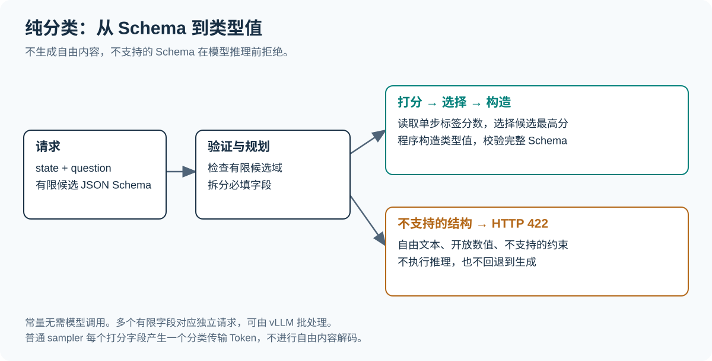
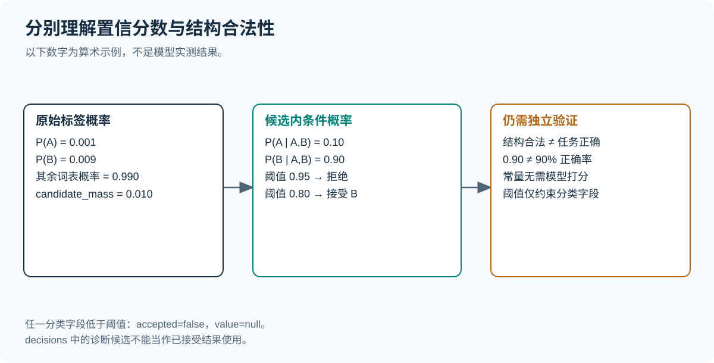
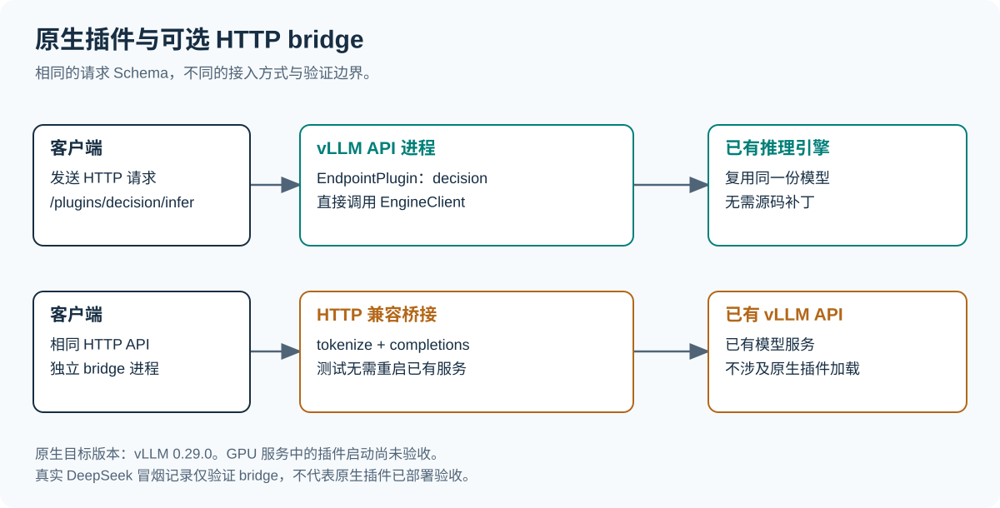

# vllm-jev-decison

**为兼容的 vLLM 语言模型提供纯分类、类型化判断 API。**

[English](README.md) · [安装与使用](docs/GUIDE.zh-CN.md) · [示例](examples) · [验证记录](results/README.md)

输入文本、问题与有限候选 JSON Schema。插件读取候选标签分数，选择类型值，再由程序
组装结果。**没有自由文本生成、组合推理或生成式回退。** 不支持的 Schema 在模型调用前拒绝。



这是独立实现的 Jev 类接口，不代表复现其模型，也不保证相同准确率或速度。
无需新增分类头、训练权重或修改 vLLM 源码。

## 安装

目标 API：**vLLM 0.29.0**，Python 3.11+。在 API 服务所在环境安装：

```bash
git clone https://github.com/siliconkernel/vllm-jev-decison.git
cd vllm-jev-decison
pip install '.[vllm]'
vllm-jev-decison doctor --model YOUR_MODEL
export VLLM_PLUGINS="${VLLM_PLUGINS:+$VLLM_PLUGINS,}jev-decison"
vllm serve YOUR_MODEL --logprobs-mode raw_logprobs
```

已有该版本 vLLM 时可用 `pip install .`。插件要求 `max_logprobs` 不低于 16；
vLLM 默认值 20 已满足，只有部署中调低过才需要显式抬高。`raw_logprobs` 同样是
vLLM 默认值，显式传入是为了默认值变化时仍然成立。`doctor --model` 会额外检查该模型是否把候选标签 A-P 编码为互不相同的单 Token
（后端的硬性前提），不满足时以非零码退出，从而在部署前暴露问题，而不是等到接口被禁用。
allowlist 保留其他必需插件。
使用 `VLLM_API_KEY` 或 `--api-key` 配置鉴权。当前从本仓库安装，不代表已发布 PyPI 包。
完整步骤与排错见[安装指南](docs/GUIDE.zh-CN.md)。

## 使用

```bash
curl http://localhost:8000/plugins/jev-decison/infer \
  -H 'Content-Type: application/json' \
  --data-binary @examples/request.json
```

启用鉴权时追加 `-H "Authorization: Bearer $VLLM_API_KEY"`。
请求示例：

```json
{
  "state":"客户说：信用卡重复扣款，请紧急退款。",
  "question":"判断请求类别及是否紧急。",
  "schema":{
    "type":"object",
    "properties":{
      "category":{"enum":["账单","技术","其他"]},
      "urgent":{"type":"boolean"}
    },
    "required":["category","urgent"],
    "additionalProperties":false
  },
  "mode":"classify",
  "min_confidence":0.8
}
```

`mode` 可省略，只接受 `classify`。`auto`、`generate`、输出生成预算和非有限字段
一律在调用模型之前被拒绝，不触发回退。非有限 Schema 返回 HTTP 422；非法的 `mode`
属于请求字段错误，原生插件下返回 HTTP 400，bridge 的纯 FastAPI 栈下返回 HTTP 422。

响应包含 `accepted`、`value`、逐字段 `decisions` 和 `usage`。
任一分类字段低于阈值时，`accepted=false`、`value=null`；`decisions` 中的候选仅供诊断。
通过 `GET /plugins/jev-decison/capabilities` 查看后端与限制。
[Python 客户端](examples/client.py) 使用 `JEV_DECISON_URL` 和可选 `JEV_DECISON_API_KEY`。

## 支持的 Schema

| 类型 | 行为 |
| --- | --- |
| 最多 16 项枚举 | 候选分类 |
| 布尔 | false / true 分类 |
| 最多 16 个值的整数区间 | 数值分类 |
| 常量、null | 程序直接构造，无需模型调用 |
| 字段全部必填、禁止额外属性的对象 | 独立字段分类，可嵌套 |
| 自由文本、开放数值、可选字段、任意数组及不支持的联合约束 | 推理前拒绝 |

显式 `enum` 或 `const` 中可以列出完整对象、数组；程序选择整个已声明值，不生成其内容。
结果仍会通过完整根 Schema 校验。

最多 32 个字段，每字段 16 个候选；输入最多 64,000 字符，Schema 最多 32 KB、
20 层 JSON 嵌套。该深度按 JSON 层级计算而非对象层级：每层嵌套对象占两级，
因此实际约可嵌套 9 层对象。`enum` 中重复的值会被合并 —— 两个标签共用同一个值
会把它的概率劈开。
使用 Draft 2020-12；v0.1 不支持引用，`format` 仅作为注解。

## 分类机制

候选值映射为经过 tokenizer 检查的 A–P 单 Token 标签。模型计算下一 Token 的 logprob，
插件取候选最高分，程序根据候选表还原类型值。模型不需要序列化对象键名或答案文本。

通用后端仍使用 vLLM 普通 sampler 的 `max_tokens=1`。这一个输出计为**分类传输 Token**，
其文本被忽略。`generated_tokens` 恒为零，不等于“零输出 Token”，也不代表新增了分类头。
多个字段对应多个引擎请求，每个 API 进程最多八个并发字段；可由 vLLM 批处理。
这不是一个 forward 回答全部字段，也不是绕过 sampler 或会话内 KV 融合。



候选内条件概率不是校准后的正确率。`candidate_mass` 单独报告标签占词表的原始概率。
标签顺序、提示、模型训练与输入分布都会影响结果。常量没有模型置信分数。
Schema 合法不等于任务判断正确。

候选顺序的影响是实测过的，不只是免责声明。Qwen3-4B 上 9 个用例、46 种排列中，
8 个用例在所有排列下结果一致，1 个翻转成错误值且**置信度 0.997**；选中位置分布
均匀（16/15/15），所以并非简单的"偏向第一个标签"，重排只会推翻模型本就接近的判断。
**`min_confidence` 挡不住这种翻转**。关键决策请用多种顺序自行验证。
见[验证记录](results/README.md)与[脚本](benchmarks/label_order_bias.py)。

## 部署与验证



原生插件使用正式 [EndpointPlugin 接口](https://docs.vllm.ai/en/v0.29.0/design/endpoint_plugins/)，
复用已有 EngineClient，不加载第二份模型。可选 bridge 连接已有 vLLM 服务：

```bash
pip install '.[bridge]'
vllm-jev-decison bridge --upstream http://127.0.0.1:8000 --model /model --port 18186
```

bridge 也仅支持分类，后端明确标记为 `http_bridge`。只要求上游支持 `/tokenize` 和
指定 Token 的原始 logprob，不再需要结构化生成。多字段会产生多个引擎请求，默认每个
API 进程最多 8 个并发，可用 `JEV_DECISON_CONCURRENCY`（1-256）与 `JEV_DECISON_TIMEOUT`
（1-3600 秒）调整；闸门按 API 进程共享，一个宽请求会延迟其他请求。实际生效值可在
`capabilities` 中查看。鉴权配置见[指南](docs/GUIDE.zh-CN.md)。
两条路径均已在真实模型上验证，相同用例下返回完全一致的判定与用量；bridge 的验证
使用的是未加载任何插件的上游服务。

面向支持自回归文本推理、单 Token 标签和原始 logprob 的兼容模型，优先使用指令模型。
Pooling、多模态、LoRA 路由及所有 tokenizer 组合尚未验证，“兼容模型”不是“任意模型”。

本地测试覆盖分类规划、拒绝生成请求、鉴权、阈值、用量、取消与模拟引擎契约。
**原生 GPU 服务的插件启动已验收**：插件在 NVIDIA GB10 上装载进真实的 vLLM API server
进程、两条路由均可用、用量记账与引擎自身 `/metrics` 计数完全对账，客户端断开时确实
释放引擎算力。相关运行使用的 vLLM 构建新于 0.29.0，但携带同一套 `EndpointPlugin` 接口。
历史 bridge 记录保留了早期组合原型，该能力现已删除，详见[验证记录](results/README.md)。
目前不保证普遍加速、生产可用或语义正确。

## 开发

```bash
python3 -m venv .venv
source .venv/bin/activate
pip install -e '.[test,bridge]'
pytest -q
python -m build
python docs/render_diagrams.py
```

[原生实测脚本](benchmarks/smoke_native.py)针对已装载的插件运行，后端为 bridge 时拒绝写入记录；
[bridge 实测脚本](benchmarks/smoke_http.py)覆盖另一条路径。两者都写入新目录，保留失败记录。
采用 MIT 许可；vLLM 保留自身许可。
