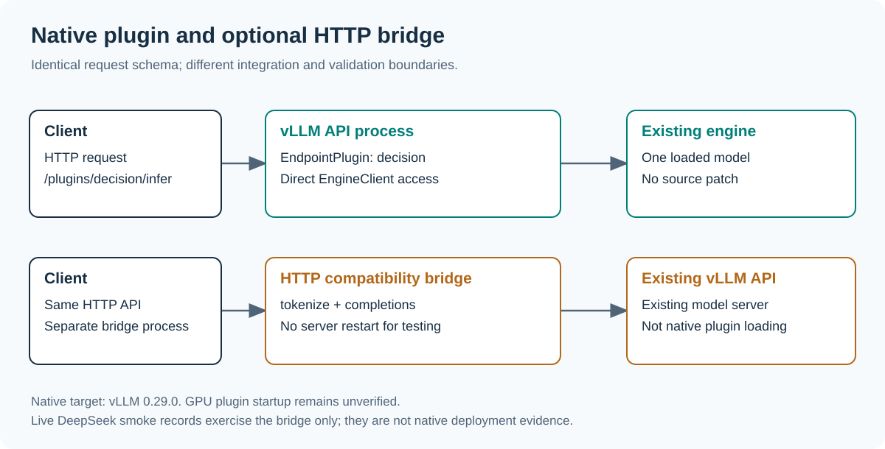
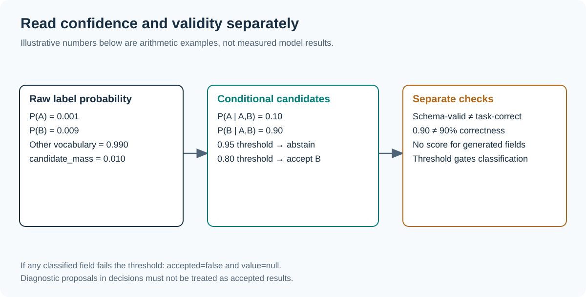

# Classification-only installation and usage

[中文指南](GUIDE.zh-CN.md) · [Project overview](../README.md)

## Choose the integration



The native plugin targets **vLLM 0.29.0** and requires installation in its API
server environment, followed by a normal server start. The optional HTTP bridge
connects to an already-running server without changing it. Native GPU plugin
startup is verified on NVIDIA GB10; see [validation records](../results/README.md)
for the recorded runs and for what those runs do not establish.

## 1. Install from this repository

The package is distributed through this repository; no PyPI publication is implied.
Use Python 3.11 or newer and a vLLM-supported platform and model.

```bash
git clone https://github.com/siliconkernel/vllm-jev-decison.git
cd vllm-jev-decison
python3 -m venv .venv
source .venv/bin/activate
python -m pip install --upgrade pip
python -m pip install '.[vllm]'
vllm-jev-decison doctor
```

The `vllm` extra pins vLLM 0.29.0 and installs its dependencies, which can be large.
If your server already has that version, activate its environment and run
`python -m pip install .` instead. Installing in a different environment will not
make the server discover the plugin.

`doctor` checks package registration and the local endpoint-plugin protocol. It
does not load a model or certify GPU compatibility. A nonzero exit means this
local environment cannot currently confirm native plugin support.

## 2. Start the native server

Set `VLLM_API_KEY` to your chosen server key and `MODEL` to a compatible model ID
or local model directory. Do not commit the key.

```bash
export MODEL=/absolute/path/to/your/model
# Set VLLM_API_KEY in your shell or deployment secret configuration.
export VLLM_PLUGINS="${VLLM_PLUGINS:+$VLLM_PLUGINS,}jev-decison"
vllm serve "$MODEL" --host 127.0.0.1 --port 8000 \
  --logprobs-mode raw_logprobs --max-logprobs 16
```

The plugin allowlist must include any other plugins needed by your deployment.
The examples bind to loopback. Configure your normal authenticated network ingress
when serving other machines; the plugin inherits the configured vLLM API keys.
It does not add a second model process. Restarting an existing server should follow
your normal maintenance process rather than running a competing copy on its GPUs.

Check the actual route, not just server health:

```bash
curl --fail-with-body http://127.0.0.1:8000/plugins/jev-decison/capabilities \
  -H "Authorization: Bearer $VLLM_API_KEY"
```

The native backend should report `vllm_endpoint_plugin`. If no API key is
configured, omit the Authorization header. A 404 usually means the plugin was
not discovered or allowlisted; inspect the startup logs.

## 3. Make a typed decision

```bash
curl --fail-with-body http://127.0.0.1:8000/plugins/jev-decison/infer \
  -H "Authorization: Bearer $VLLM_API_KEY" \
  -H 'Content-Type: application/json' \
  --data-binary @examples/request.json
```

The example asks for a request category and urgency flag. Change `state` and
`question` to your task. Use JSON Schema `description` to clarify individual
fields. Finite fields support enums, booleans and small integer ranges. For a
nested object to be decomposed, every property must be required and
`additionalProperties` must be false.

| Request field | Meaning |
| --- | --- |
| `state` | Input text, up to 64,000 characters |
| `question` | Task instruction |
| `schema` | Draft 2020-12 output schema, without references |
| `mode` | Optional; only `classify` is accepted |
| `min_confidence` | Classification-only acceptance threshold, default 0 |

All fields must have finite candidate domains. Free text, open numbers, optional
fields and unsupported joint constraints are rejected before inference. `auto`,
`generate` and `max_tokens` are rejected; there is no generation or fallback.

The standard-library Python client uses its own configuration names:

```bash
export JEV_DECISON_URL=http://127.0.0.1:8000
export JEV_DECISON_API_KEY="$VLLM_API_KEY"
python examples/client.py
```

## 4. Handle results and abstention



Only use `value` when `accepted` is true. When a classified field falls below the
threshold, `accepted` is false and `value` is null. Values retained in `decisions`
are diagnostic proposals. Handle that case with your own review or fallback policy.
The plugin does not automatically generate a replacement answer after abstention.

A classified field exposes its selected value, conditional `confidence`, all
candidate probabilities/logprobs, and `candidate_mass`. A constant field has
`confidence=null` because its value is constructed without model inference.
No confidence number is a calibrated probability of correctness.

`usage` separates `input_tokens`, `classification_tokens`, `generated_tokens` and
`engine_requests`. `generated_tokens` is always zero, while each scored field
still consumes one classification transport token. Several fields can run concurrently but remain separate model
requests. Compare total work, accuracy and elapsed time; fewer output tokens alone
are not proof of acceleration. Failed requests can consume work without a final
usage response.

## Optional: use the HTTP bridge

If you want to try an existing compatible server without restarting it:

```bash
python -m pip install '.[bridge]'
# Optional: JEV_DECISON_UPSTREAM_API_KEY authenticates to the upstream server.
# Optional: JEV_DECISON_API_KEY authenticates clients to this bridge.
vllm-jev-decison bridge --upstream http://127.0.0.1:8000 \
  --model /model --host 127.0.0.1 --port 18186
```

Use the same routes on port 18186. Set `JEV_DECISON_URL=http://127.0.0.1:18186` for the
Python client. The capabilities endpoint must report `http_bridge`.
The upstream must provide `/tokenize`, requested-token logprobs, only. It must use raw logprobs; the bridge cannot verify that startup setting.
The bridge ignores proxy environment variables and connects directly.

## Troubleshooting

| Symptom | Action |
| --- | --- |
| `doctor` reports missing vLLM | Install the native extra in the server environment, or use the bridge explicitly |
| Plugin route returns 404 | Check `VLLM_PLUGINS`, installed entry points, vLLM version and startup logs |
| HTTP 401 | Use the configured Bearer key; bridge and upstream keys are separate |
| HTTP 400 | A request field is invalid, most often `mode`; the native server maps request validation to 400 |
| HTTP 422 | Check schema limits, unsupported references or nonfinite fields |
| HTTP 502 | Inspect upstream compatibility, token labels, requested raw logprobs and candidate-token compatibility |
| HTTP 504 | The overall inference deadline expired; inspect engine load and task size |
| `accepted=false` | The classification threshold rejected at least one field; do not dispatch diagnostic values |
| Valid output but wrong answer | Evaluate model/task fit and prompts; Schema validation is not semantic verification |

## Reproduce validation

```bash
python -m pip install -e '.[test,bridge]'
pytest -q
python -m build
python docs/render_diagrams.py
python benchmarks/smoke_http.py --url http://127.0.0.1:8000 \
  --model /model --out results/my-new-run
```

Use a fresh smoke output directory. Existing records include early failures and
prompt revisions. See [validation records](../results/README.md) for the exact
scope; these are development smoke tests, not a production or multi-model benchmark.
